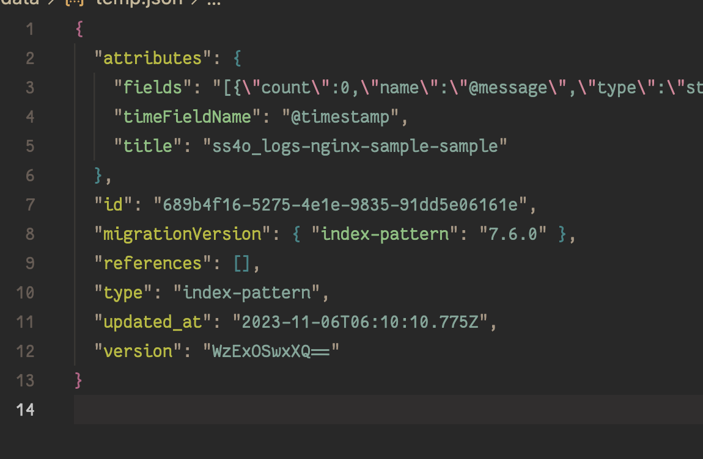
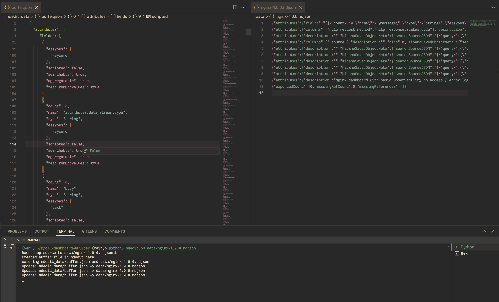

# Integrations Dashboard Builder Helper

WIP work on a script to automatically assemble dashboards from field info. In the mean time here's a
few more incremental scripts:

## NDEdit

A helper for editing OSD saved object NDjson files directly. Editing these files by hand is tricky
because of the NDJson formatting making it hard to read what's going on. Even if you copy the lines
to a new file to format them, they also do this thing where the nested values are sometimes
string-encoded JSON objects.

<p align="center">
    
    <br>
    <i>Not pictured: line 3 is 16000 columns long</i>
</p>

The normal way to update these saved objects is using the UI to edit these objects safely, but this also doesn't always work:
- Bulk updating fields is hard, if you just want to rename a bunch of things (e.g. refactoring dashboards to use a new timestamp field)
- Other fields support multiple values, but can't be edited from the UI at all (e.g. the name of an index pattern)
- Sometimes these objects will be corrupted [due to software bugs](https://github.com/opensearch-project/dashboards-reporting/issues/371).
  
Currently the only way to fix objects in any of these cases is curling APIs, or trying to work
through these opaque files.

NDEdit is a script that dynamically loads an NDJson file for editing, as regularly formatted JSON.
Now you can read exactly what data is in your exported saved objects, and edit it fluidly. The
script watches the file for changes, and writes them back to the original file. This makes hacking
seamless.

```sh
$ pip install -r requirements.txt
$ python3 ndedit.py <file>.ndjson
```



## Field Filter

A helper script to get field names out of an ndjson bundle and validate that Dashboard Panels are
compatible with a given data schema. Saves a *lot* of time if you're trying to port a dashboard or
two from another data format to your own. Some assembly is likely required for your use case, as I
was lazy and made changing behavior require code edits instead of CLI flags (longstanding todo...).

Usage:

```sh
$ pip install -r requirements.txt
$ python3 field_filter.py <ndjson file> <field file>
```
