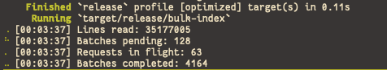

# OpenSearch Bulk Indexer



Utility CLI for indexing files in OpenSearch as fast as possible.
It also supports scanning indices via `--scan`, which is useful for saving test datasets, or cross-cluster reindexing without hassle.

## Installation

Clone & cd to this directory, then just install with Cargo:

```
% cargo install --path .
```

## Usage

This indexes the specified newline-delimited json file into an index, respecting the compression specified in the extension.
Alternative endpoints and auth details are optional.

```bash
$ bulk-index --help
Bulk index documents into OpenSearch/Elasticsearch, or scan/export them

Usage: bulk-index [OPTIONS] --index <INDEX>

Options:
  -i, --index <INDEX>
          Target index name
  -e, --endpoint <ENDPOINT>
          OpenSearch/Elasticsearch endpoint URL [default: http://localhost:9200]
  -u, --username <USERNAME>
          Username for HTTP basic authentication
  -p, --password <PASSWORD>
          Password for HTTP basic authentication
      --scan
          Scan mode: export documents from the index to stdout as NDJSON
  -f, --file <FILE>
          Path to the dataset file (supports .json, .json.gz, .json.bz2, .json.zst). Defaults to stdin if not provided
  -l, --limit <LIMIT>
          Maximum number of lines to read (optional, reads all if not specified)
  -b, --batch-size <BATCH_SIZE>
          Number of documents per batch [default: 8192]
  -c, --concurrent-requests <CONCURRENT_REQUESTS>
          Maximum number of concurrent requests [default: 32]
      --max-pending-batches <MAX_PENDING_BATCHES>
          Maximum number of in-progress batches to concurrently keep in memory [default: 64]
      --live
          Live mode: skip _id field and replace timestamps with current time
  -r, --rate <RATE>
          Rate limit in documents per second (optional, no limit if not specified)
      --scroll-timeout <SCROLL_TIMEOUT>
          Scroll timeout for scan operations (e.g., "1m", "30s") [default: 1m]
      --query <QUERY>
          Query to filter documents during scan (JSON query DSL)
      --scroll-size <SCROLL_SIZE>
          Size of each scroll batch [default: 1000]
  -h, --help
          Print help
```
